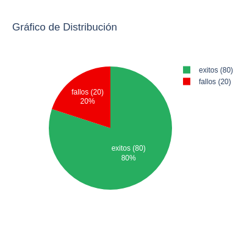
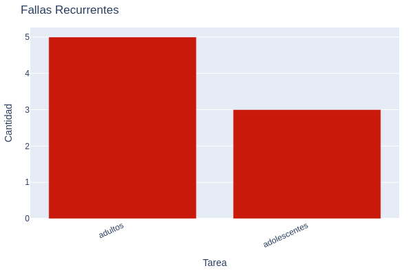

# Módulo Ansible: `graficos`

Este módulo genera dos tipos de gráficos a partir de los resultados de tareas automatizadas; un gráfico de torta para éxitos y fallos, y un gráfico de barras para representar metricas agrupadas. Utiliza la biblioteca `plotly` para crear visualizaciones exportables en formato PNG. (Plotly)

## Requisitos

- Ansible
- Python 3.x
- chromium o chrome
- Dependencias Python:
  - Plotly  
  - Kaleido
  - Numpy
  - Pandas
- Dependencias S.O:
  - libX11 
  - libXcomposite 
  - libXcursor 
  - libXdamage 
  - libXext 
  - libXi 
  - libXtst 
  - libxkbcommon 
  - libXrandr 
  - libXcomposite 
  - libxshmfence 
  - libXScrnSaver 
  - libX11-xcb
  - mesa-libgbm
  - nss 
  - alsa-lib
  - cups-libs
  - pango
  - atk
  - at-spi2-atk

```bash
$ pip install <librería>
```

```bash
# Instalación de chromium manual por sí lo requieren.

$ curl -L -o chrome-linux.zip https://download-chromium.appspot.com/dl/Linux_x64?type=snapshots
$ unzip chrome-linux.zip -d /opt
$ ln -s /opt/chrome-linux/chrome /usr/local/bin/chrome
```
## Parámetros

| Parámetro              | Tipo   | Requerido | Descripción |
|---------------------|--------|-----------|-------------|
| `exitos`            | int    | Sí        | Número total de tareas exitosas. |
| `fallos`            | int    | Sí        | Número total de tareas fallidas. |
| `recurrencias`      | dict   | No        | Diccionario con (clave = nombre de tarea, valor = cantidad). |
| `carpeta_salida`    | str    | No        | Carpeta donde se guardarán los gráficos generados. Por defecto es el directorio actual (`.`). |
| `incluir_base64`    | bool   | No        | Si se establece en `true`, se incluirán las versiones codificadas en Base64 de los gráficos en la salida del módulo. |

## Uso 

```yaml
- name: Generar gráficos con valores hardcodeados
  graficos:
    exitos: 80
    fallos: 20
    recurrencias:
      adultos: 5
      adolescentes: 3
    carpeta_salida: "/tmp"
    incluir_base64: true

- name: Generar gráficos con variables y sin base64
  graficos:
    exitos: "{{ tasa_exito }}"
    fallos: "{{ tasa_fallo }}"
    recurrencias: "{{ asistentes }}"
    carpeta_salida: "/tmp"
  vars:
    tasa_exito: 80
    tasa_fallo: 20
    asistentes:
        adultos: 5
        adolescentes: 3 
```

## Ejemplo de graficos generados:

#### Grafico torta



#### Gráfico de barras



## Retorno

El módulo devuelve un diccionario con las rutas de los archivos generados y, si se solicita, sus representaciones en Base64:

```yaml
{
  "changed": true,
  "grafico_torta": "/tmp/grafico_torta.png",
  "grafico_barras": "/tmp/grafico_barras.png",
  "grafico_torta_base64": "iVBORw0K...",
  "grafico_barras_base64": "iVBORw0K...",
  "msg": "Gráficos generados correctamente"
}
```

## Notas

- Puedes usar las imágenes en reportes HTML o insertarlas directamente en documentos PDF.

## Author

- [@Xploit9999](https://github.com/Xploit9999)
